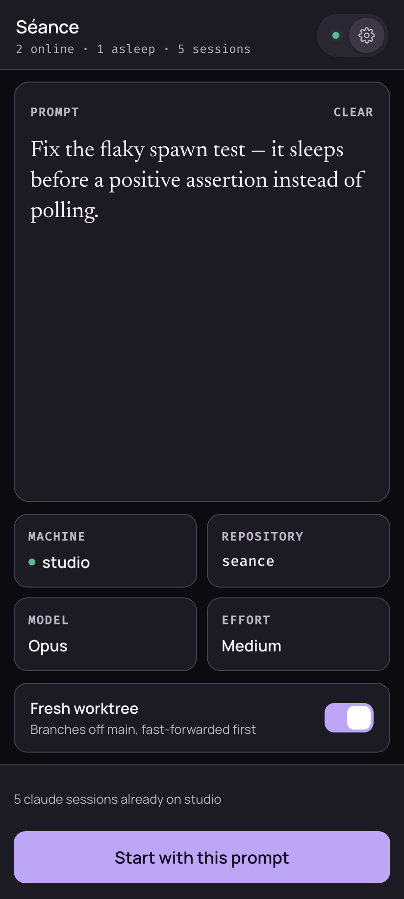
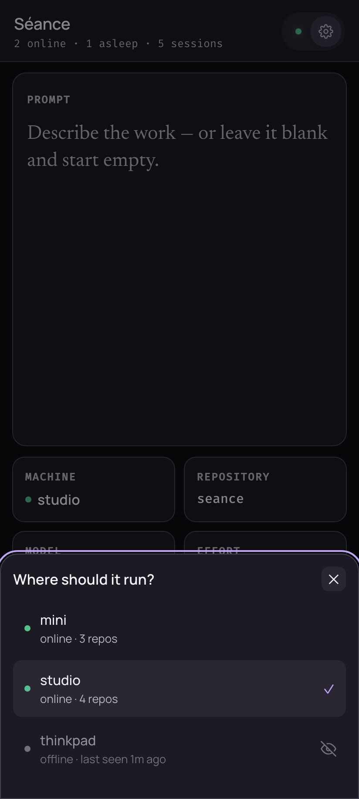
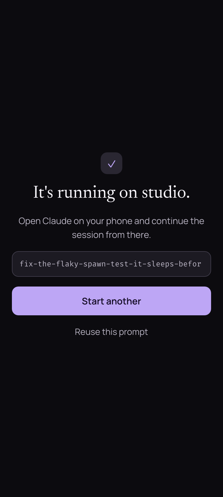

# Séance

Spawn new Claude Code sessions on any of your machines, from your phone.

[Setup](#setup) · [Usage](#usage) · [Docs](#docs)

<p align="center">
  
</p>

- **Starts sessions — doesn't just continue them.** Claude Code Remote Control
  resumes what already exists; Séance creates.
- **Every machine you own, with no pairing step.** macOS, Linux, WSL: a daemon
  holding the right token and key simply appears in the app.
- **A fresh worktree per session, by default.** It fetches and fast-forwards the
  default branch first, so a spawn never disturbs what you're in the middle of.
- **The relay is blind.** It routes ciphertext; the pre-shared key never leaves your
  own devices.
- **Free to run.** A Worker and a SQLite-backed Durable Object for the relay, a
  static-assets Worker for the app — all inside Cloudflare's free tier.
- **Daemons update themselves.** `git pull` and restart on one machine; the rest
  fetch, fast-forward, and restart on their own.

## Why

Claude Code Remote Control lets you _continue_ sessions from your phone, but
can't _start_ new ones on a machine remotely. Keeping a persistent "god"
session alive just to run a spawn script works, but it's fragile and
awkward. Séance replaces it with a per-machine daemon that's always ready.

## Security

The relay is a router, not a participant: every payload crossing it is sealed with a
pre-shared key you mint yourself, so Cloudflare stores and forwards ciphertext it
cannot read. The bearer token only gates access to the relay — the PSK is the actual
trust boundary, and it belongs in a platform key store rather than a file
([docs/psk.md](docs/psk.md)). On the machine, spawns exec argv arrays — the one
shell string is the tmux command line, where every wire-supplied value is
shell-quoted and the prompt travels by temp file, never argv — repos resolve by
name against a cached scan set rather than by path, and
prompt text is never written to the log. DESIGN.md carries the full threat model,
including what this deliberately does not defend against.

## How it fits together

| Component | Where it runs                                                            | What it does                                                                                                                                    |
| --------- | ------------------------------------------------------------------------ | ----------------------------------------------------------------------------------------------------------------------------------------------- |
| `relay/`  | Cloudflare Worker + Durable Object                                       | Routes opaque encrypted blobs phone↔daemon, persists machine registry (presence = discovery)                                                    |
| `daemon/` | Each dev machine (Bun; launchd on macOS, systemd user unit on Linux/WSL) | Holds WebSocket to relay, scans repo roots, spawns `claude` in a named tmux session; `seanced mcp` serves the same reach to a local Claude Code |
| `pwa/`    | Cloudflare Worker (static assets)                                        | Spawn form, machine and repo pickers, spawn verdicts, per-machine counts of running sessions                                                    |

See [DESIGN.md](DESIGN.md) for the full architecture and every decision with
its rationale.

## Setup

Everything runs from one dev machine — which can also be the first daemon
machine. There is no chicken-and-egg: the two secrets are minted by you before
anything exists, and the only other shared value (the relay URL) is _produced_
by step 2 and consumed by steps 3 and 4.

Prerequisites: [Bun](https://bun.sh), a Cloudflare account, and this repo cloned with
`bun install` run at the root. The relay is one Worker plus one SQLite-backed Durable
Object, so it fits the free tier — no paid plan needed. Each daemon machine (macOS,
Linux, or WSL) additionally needs `tmux`, `git`, and `claude` on PATH. Linux machines
need systemd for `seanced install` — a standard Debian/Ubuntu box, VM, or LXC
container (unprivileged is fine) qualifies; without systemd, run `seanced` under your
own supervisor. **On WSL, enable systemd before anything else**: `systemd=true` under
`[boot]` in `/etc/wsl.conf`, which takes a `wsl.exe --shutdown` to apply and kills
every session on the box ([docs/platform-notes.md](docs/platform-notes.md)).

### 1. Mint the shared secrets

```sh
openssl rand -base64 32 | tr '+/' '-_' | tr -d '='   # bearer token
openssl rand -base64 32                               # PSK
```

Keep both in a password manager — every daemon and the phone get the same two
values. The bearer token must be base64url-safe because the app sends it as a
query parameter: a `+` decodes to a space and you get a silent 401 instead of
an error. The PSK is the actual trust boundary; the relay never sees it.

### 2. Deploy the relay

```sh
cd relay
bun run wrangler login                     # once
bun run wrangler secret put BEARER_TOKEN   # paste the bearer token
bun run deploy                             # prints https://seance-relay.<subdomain>.workers.dev
```

Note the `<subdomain>` in the printed URL — steps 3 and 4 derive their URLs
from it.

The first deploy also mints the `workers.dev` hostname, which needs a few
minutes to route and get a certificate. Until it does, requests fail the TLS
handshake or return a 404 with body `error code: 1042` — propagation, not a
broken deploy. The edge caches those errors, so re-check with a cache-buster
(`curl -sI '<url>/?x=1'`) rather than the path you already probed.

### 3. Deploy the app

`VITE_RELAY_URL` is required: it pins the CSP's `connect-src` to your relay, so
a build without it fails rather than shipping a page that cannot connect. It
also means pointing the app at a different relay later requires a rebuild, not
just a settings edit.

```sh
cd pwa
VITE_RELAY_URL=wss://seance-relay.<subdomain>.workers.dev/app bun run deploy
```

Or put it in a gitignored `pwa/.env` (see `.env.example`) and just
`bun run deploy`. This hostname is new too — the step 2 propagation note
applies again.

### 4. Install seanced on each machine

Distribution is the git checkout itself: the service runs
`bun <checkout>/daemon/src/main.ts`, so updating is `git pull` + restart.

```sh
git clone <this repo> && cd seance && bun install
bun daemon/src/main.ts init      # writes the ~/.config/seance/config.json skeleton
```

The CLI runs the same way, and to spare the typing:

```sh
bun daemon/src/main.ts link      # symlinks `seanced` into a dir on your PATH
```

The link is a plain symlink to `main.ts` (executable, `bun` shebang), so it
tracks `git pull` and source edits with nothing to re-run. It prefers
`~/.local/bin`, or takes a dir explicitly (`link <dir>`); `seanced unlink`
removes it, as does `uninstall`. A shell alias (`alias seanced='bun
<checkout>/daemon/src/main.ts'`) works too. `doctor` and `install` warn when
the name doesn't resolve — or resolves into a different checkout, which
`link` repoints — though they can't see an alias.

Edit `~/.config/seance/config.json`:

- `relayUrl` — `wss://seance-relay.<subdomain>.workers.dev/daemon` (must end
  in `/daemon`)
- `bearerToken` — from step 1
- `psk` — from step 1, or leave it empty and run `seanced psk-import` to keep the key
  in the platform store instead (macOS login keychain / WSL DPAPI blob / Linux
  TPM-sealed blob), which is where it belongs — see [docs/psk.md](docs/psk.md). Linux
  without a usable TPM has no such store; there the PSK stays in `config.json`, which
  `init` creates 0600. On systemd ≥ 256 the sealed blob is instead sealed once as root
  and delivered to the unit by PID 1, which `psk-import` can't do — docs/psk.md has
  that runbook.
- `repoRoots` — directories to scan for repos

A running daemon watches this file and reloads within a second of a save, so
edits need no restart — including ones made by a Claude Code session on the
box. A bad edit is refused with the reason in the log and the previous config
keeps running, so the machine never drops offline over a typo. Only a code
change still needs `seanced restart`. A repo added _inside_ an existing root
needs nothing at all — the hourly rescan, or the app's refresh, picks it up.

```sh
bun daemon/src/main.ts doctor    # preflight: config, tmux/git/claude, relay reachability
bun daemon/src/main.ts install   # macOS: launchd agent (RunAtLoad + KeepAlive)
                                 # Linux/WSL: systemd user unit + linger (+ a Windows logon task on WSL)
```

Both platforms have sharp edges worth knowing about — linger on a headless Linux
box, the WSL logon pin task, and what happens while no Windows user is logged in —
collected in [docs/platform-notes.md](docs/platform-notes.md).

`doctor` prints a PSK fingerprint — compare it across machines to confirm they
all hold the same key. (Not on a box whose key is delivered to its unit by
systemd: nothing outside the unit can read it, so the fingerprint is in the
daemon's log instead.) A daemon with the right token and PSK simply appears in
the app; there is no pairing step.

### 5. Set up the phone

Open `https://seance-pwa.<subdomain>.workers.dev`, add it to your home screen,
and in first-run setup enter the relay URL
(`wss://seance-relay.<subdomain>.workers.dev/app`), the bearer token, and the
PSK. Machines appear as their daemons register.

### 6. Optional: give a local Claude Code the same reach

On any machine that runs `seanced`:

```sh
seanced mcp install    # registers the MCP server with Claude Code (user scope)
```

Claude Code sessions on that machine can then reach every other machine through the
relay — see [From another Claude Code session](#from-another-claude-code-session).
`seanced mcp uninstall` removes it; `seanced doctor` reports whether it is
registered.

The entry records bun by its PATH name, so upgrading bun doesn't break it. It is
per Claude config directory, though: if you run Claude Code with a non-default
`CLAUDE_CONFIG_DIR`, run `seanced mcp install` once from a session using it.

## Usage

### From the phone

Type what the session should do — or leave the prompt blank to start an empty one —
then pick where it runs. Four tiles open pickers: **machine**, **repository**,
**model** (Fable / Opus / Sonnet), and **effort** (Low through Max). **Fresh
worktree** is on by default; switching it off runs the session in the repo as it
stands. Then start it.

The verdict names the tmux window it created, and from there you continue the session
in the Claude app like any other. Two things keep you from spawning duplicates: the
header counts sessions across every machine (`2 online · 1 asleep · 3 sessions`), and
the footer counts what is already running on the machine you picked. The repo list
comes from that daemon's last scan — **↻ Rescan repos** in the repository picker
refreshes it, and a spawn that cannot find its repo offers to rescan and retry.

There is no title field: the daemon names the tmux window after the prompt.

<p align="center">
  
  
</p>

### From the machine

```sh
seanced spawn seance -t "flaky test" -p "fix the flaky spawn test"
#   note: local main diverged from origin — worktree bases on local HEAD
#   spawned 'flaky test' (~/repos/seance/.claude/worktrees/flaky-test)

seanced spawn seance --here   # run in the checkout as it stands, no worktree
seanced sessions              # running claude windows: window, repo, path
seanced status                # this machine: service, relay, repo count, running vs on-disk sha
seanced doctor                # preflight config, binaries, roots, relay, service
seanced help                  # every command
```

`<repo>` is a _name_, matched exactly against the cached scan set and never joined as
a path — so it is whatever `seanced scan` calls the repo (a bare basename, or
`parent/base` when two collide). Bare words after it become the prompt, which makes
`-p` optional: `seanced spawn seance fix the flaky test` works.

Worktree mode, the default, fetches the repo's default branch, fast-forwards the main
checkout when it is clean and on that branch, and puts the session in
`.claude/worktrees/<slug>` on a `worktree-<slug>` branch. `--here` skips all of that
and runs in the checkout you already have.

`status` reports the machine you run it on — including the sha the daemon is running
versus the one on disk, which is how you spot a `git pull` that still needs a
`restart`. The cross-machine view is the app, or `list_machines` over MCP.

### From another Claude Code session

With `seanced mcp install` done (step 6), a local Claude Code can list machines,
query running sessions, and spawn sessions on other machines through the relay:
`list_machines`, `get_sessions`, `spawn_session`. The server reads the daemon's own
config and speaks to the relay exactly like the phone does.

Treat `spawn_session` like the remote it is: leave it behind Claude Code's per-tool
approval rather than allowlisting it.

## Updating

```sh
git pull && bun daemon/src/main.ts restart    # daemon, on one machine
bun run --cwd relay deploy                    # relay
VITE_RELAY_URL=... bun run --cwd pwa deploy   # app
```

Daemons self-propagate: the restarted daemon notices its version changed and
announces it over the relay, and every other machine fetches, fast-forwards
its default branch, runs `bun install --frozen-lockfile`, and restarts itself.
A machine that was asleep or offline catches up on its next reconnect. A
checkout that is dirty, on another branch, or has local commits is skipped —
never forced — and reports why; `seanced status` on that machine shows its version
and its last update outcome. Relay and app deploys stay manual wrangler steps.

Service definitions already on disk lag behind the code that writes them, and
machines installed before certain fixes need a one-time catch-up — both in
[docs/platform-notes.md](docs/platform-notes.md). `seanced doctor` flags a machine
that still needs it.

## Docs

- [docs/psk.md](docs/psk.md) — where the pre-shared key lives on each platform, how to
  import it without it touching argv or shell history, and what the TPM path does and
  does not protect.
- [docs/platform-notes.md](docs/platform-notes.md) — WSL and Linux service specifics,
  plus the one-time catch-up for older installs.
- [docs/development.md](docs/development.md) — running the relay and app locally, and
  the test suite.

This is a personal project shared publicly rather than one looking for contributors:
issues and observations are welcome, but the roadmap is whatever I happen to need
next.

## License

[MIT](LICENSE)
